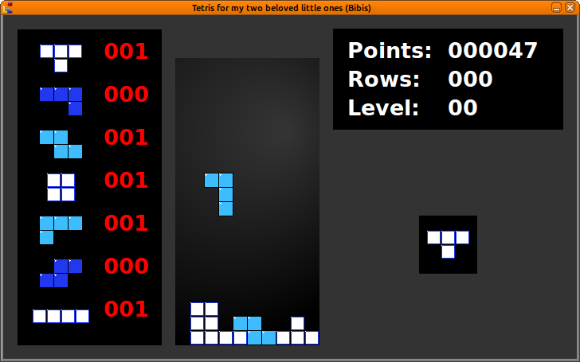

# Bibi Tetris
A simple Tetris version for my two beloved little ones (Bibis).

It's implemented in C using Gtk+ and libcanberra for playing sounds.

It's graphics and layout is in some ways based on the ones from the good old the Nintendo Entertainment System (NES).

Here's a screenshot on how it looks so far:

